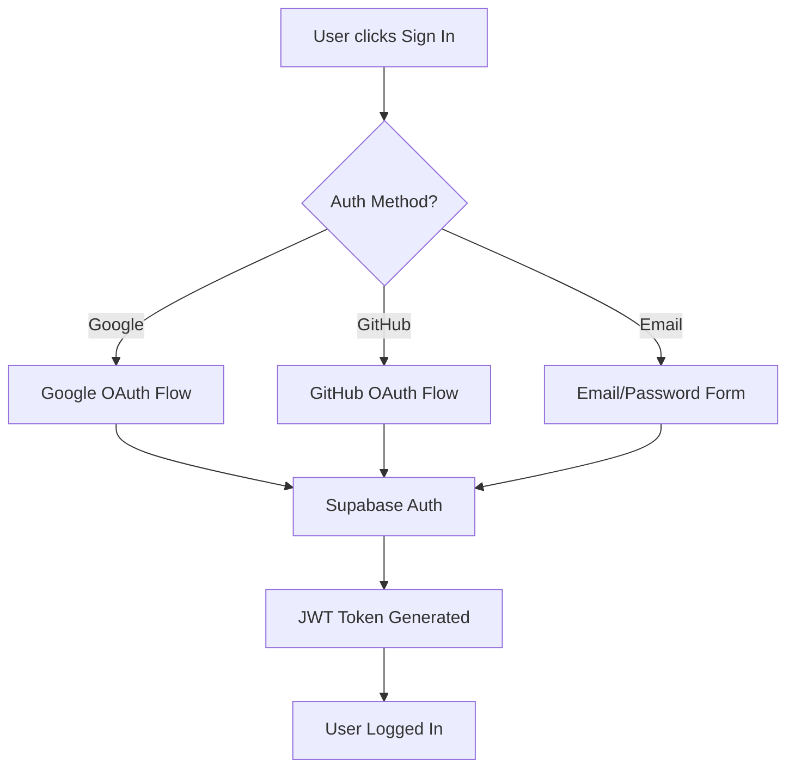

# 🔐 Authentication Setup Guide

This guide explains how to set up GitHub and Google OAuth authentication for your Nexiloop AI application.

## 🎯 Overview

The application supports multiple authentication methods:
- ✅ **Google OAuth** - Sign in with Google account
- ✅ **GitHub OAuth** - Sign in with GitHub account  
- ✅ **Email/Password** - Traditional email signup/signin
- ✅ **Guest Mode** - Limited functionality without signup

## 🚀 Quick Setup (Supabase Dashboard)

### Step 1: Access Supabase Authentication Settings
1. Go to your **Supabase Dashboard**
2. Select your project
3. Navigate to **Authentication** → **Providers**

### Step 2: Configure Google OAuth

1. **Enable Google Provider**:
   - Toggle **Google** to enabled
   
2. **Get Google OAuth Credentials**:
   - Go to [Google Cloud Console](https://console.cloud.google.com/)
   - Create a new project or select existing one
   - Enable the **Google+ API**
   - Go to **Credentials** → **Create Credentials** → **OAuth 2.0 Client IDs**
   - Application type: **Web application**
   - Add authorized redirect URIs:
     ```
     https://your-project-ref.supabase.co/auth/v1/callback
     ```
   - Copy the **Client ID** and **Client Secret**

3. **Configure in Supabase**:
   - Paste **Client ID** and **Client Secret** in Supabase Google provider settings
   - Save the configuration

### Step 3: Configure GitHub OAuth

1. **Enable GitHub Provider**:
   - Toggle **GitHub** to enabled
   
2. **Get GitHub OAuth Credentials**:
   - Go to [GitHub Developer Settings](https://github.com/settings/developers)
   - Click **New OAuth App**
   - Fill out the form:
     - **Application name**: `Nexiloop AI`
     - **Homepage URL**: `https://your-domain.com`
     - **Authorization callback URL**: 
       ```
       https://your-project-ref.supabase.co/auth/v1/callback
       ```
   - Click **Register application**
   - Copy the **Client ID** and generate a **Client Secret**

3. **Configure in Supabase**:
   - Paste **Client ID** and **Client Secret** in Supabase GitHub provider settings
   - Save the configuration

## 🔧 Environment Variables

Add these to your `.env.local` file:

```bash
# Supabase Configuration (required)
NEXT_PUBLIC_SUPABASE_URL=https://your-project-ref.supabase.co
NEXT_PUBLIC_SUPABASE_ANON_KEY=your-anon-key

# OAuth Configuration (optional - handled by Supabase)
# These are automatically configured through Supabase dashboard
NEXT_PUBLIC_SUPABASE_GITHUB_CLIENT_ID=your_github_client_id
SUPABASE_GITHUB_CLIENT_SECRET=your_github_client_secret
NEXT_PUBLIC_SUPABASE_GOOGLE_CLIENT_ID=your_google_client_id  
SUPABASE_GOOGLE_CLIENT_SECRET=your_google_client_secret
```

## 🧪 Testing Authentication

### Test Google OAuth:
1. Go to `/auth` in your application
2. Click **"Continue with Google"**
3. Complete Google OAuth flow
4. Should redirect back to your app and be logged in

### Test GitHub OAuth:
1. Go to `/auth` in your application  
2. Click **"Continue with GitHub"**
3. Complete GitHub OAuth flow
4. Should redirect back to your app and be logged in

### Test Email/Password:
1. Go to `/auth` in your application
2. Enter email and password
3. Click **"Sign Up"** for new accounts or **"Sign In"** for existing
4. For signup, check email for confirmation link

## 🔐 Security Features

### Row Level Security (RLS)
- Users can only access their own data
- Agents can be public or private
- Chats and messages are private to the user

### CSRF Protection
- All forms include CSRF tokens
- API routes validate CSRF headers
- Set `CSRF_SECRET` in environment variables

### Authentication Flow


## 🐛 Troubleshooting

### Common Issues:

1. **"Invalid redirect URI"**
   - Check that callback URLs match exactly in OAuth provider settings
   - Ensure no trailing slashes
   - Use the exact Supabase URL format

2. **"OAuth provider not configured"**
   - Verify provider is enabled in Supabase dashboard
   - Check Client ID and Secret are correctly entered
   - Ensure secrets are not exposed in client-side code

3. **"Failed to authenticate"**
   - Check Supabase project is active
   - Verify environment variables are loaded
   - Check browser console for detailed errors

4. **Email confirmation not working**
   - Check Supabase email templates
   - Verify SMTP settings (if using custom SMTP)
   - Check spam folder

### Debug Mode:
Enable debug logging by setting:
```bash
NODE_ENV=development
```

## 📚 Additional Resources

- [Supabase Auth Documentation](https://supabase.com/docs/guides/auth)
- [Google OAuth Setup](https://developers.google.com/identity/protocols/oauth2)
- [GitHub OAuth Apps](https://docs.github.com/en/developers/apps/building-oauth-apps)
- [Next.js Authentication](https://nextjs.org/docs/authentication)

## 🚀 Production Deployment

### Before going live:
1. ✅ Set up proper domain and SSL certificate
2. ✅ Update OAuth redirect URLs to production domain
3. ✅ Set production environment variables
4. ✅ Test all authentication flows
5. ✅ Enable Supabase RLS policies
6. ✅ Set strong CSRF secret
7. ✅ Configure email templates

---

**Need help?** Check the [troubleshooting section](#-troubleshooting) or open an issue on GitHub.
