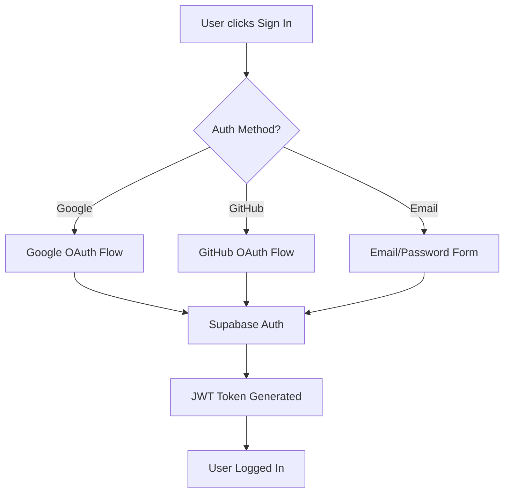

# 🔐 Auth Setup (Super Easy!)

Yo! Setting up login is actually way easier than you think because Supabase does all the heavy lifting for us 💪

## 🎯 What You Get

Your app comes with these login options out of the box:
- 🔥 **Google Login** - One click, boom, you're in
- 🐙 **GitHub Login** - For all the devs out there  
- 📧 **Email/Password** - Classic style if you're into that
- 👻 **Guest Mode** - Just browse around, no commitment

## 🚀 Super Quick Setup (Like 5 Minutes!)

### Step 1: Hit Up Your Supabase Dashboard
1. Go to your Supabase project dashboard
2. Click **Authentication** in the sidebar
3. Click **Providers** tab

### Step 2: Enable Google Login (Optional but Recommended)
1. **Toggle Google ON** ✅
2. **Get Google credentials**:
   - Head to [Google Cloud Console](https://console.cloud.google.com/)
   - Create project (or use existing)
   - Enable Google+ API
   - Create OAuth 2.0 credentials
   - Add redirect URI: `https://your-project-ref.supabase.co/auth/v1/callback`
   - Copy Client ID and Secret
3. **Paste into Supabase** and save 💾

### Step 3: Enable GitHub Login (Optional but Cool)
1. **Toggle GitHub ON** ✅
2. **Get GitHub credentials**:
   - Go to [GitHub Developer Settings](https://github.com/settings/developers)
   - Create new OAuth App
   - Set callback URL: `https://your-project-ref.supabase.co/auth/v1/callback`
   - Copy Client ID and generate Secret
3. **Paste into Supabase** and save 💾

### Step 4: You're Done! 🎉
Seriously, that's it. No environment variables to mess with, no complex config files. Supabase handles everything internally.

## 🔧 Environment Variables (Just The Basics)

Only need these in your `.env.local`:

```bash
# Supabase (required)
NEXT_PUBLIC_SUPABASE_URL=https://your-project-ref.supabase.co
NEXT_PUBLIC_SUPABASE_ANON_KEY=your-anon-key

# Security (required)
CSRF_SECRET=your_32_character_random_string
```

**No OAuth secrets needed!** 🙌 Supabase keeps all that secure stuff locked up tight.

## 🧪 Test It Out

1. Go to `/auth` in your app
2. Try the login buttons
3. If something breaks, check the troubleshooting below 👇

## 🐛 When Things Go Wrong

**"Invalid redirect URI"**
- Make sure your callback URL is exactly: `https://your-project-ref.supabase.co/auth/v1/callback`
- No typos, no extra slashes

**"Provider not found"**
- Check that you toggled the provider ON in Supabase
- Make sure you clicked save after adding credentials

**Still broken?**
- Check browser console for errors
- Verify your Supabase project URL is correct
- Try incognito mode to rule out cache issues

## 💡 Pro Tips

- **Email confirmation**: Supabase sends confirmation emails automatically
- **User data**: All user info is stored securely in Supabase
- **Custom domains**: Update OAuth redirect URLs when you go live
- **Rate limiting**: Supabase has built-in protection against abuse

## 🎮 How It Actually Works

```
User clicks "Sign in with Google" 
    → Google OAuth popup opens
    → User approves
    → Google sends user back to Supabase
    → Supabase creates/updates user
    → User gets logged into your app
    → Everyone's happy! 🎉
```

No complex JWT handling, no session management headaches. Supabase does it all!

## 🔧 Environment Variables

You only need these basic Supabase variables (OAuth is handled internally by Supabase):

```bash
# Supabase Configuration (required)
NEXT_PUBLIC_SUPABASE_URL=https://your-project-ref.supabase.co
NEXT_PUBLIC_SUPABASE_ANON_KEY=your-anon-key

# CSRF Protection (required)
CSRF_SECRET=your_32_character_random_string
```

**That's it!** 🎉 No OAuth client IDs or secrets needed in your environment variables because Supabase handles all OAuth configuration internally through the dashboard.

## 🧪 Testing Authentication

### Test Google OAuth:
1. Go to `/auth` in your application
2. Click **"Continue with Google"**
3. Complete Google OAuth flow
4. Should redirect back to your app and be logged in

### Test GitHub OAuth:
1. Go to `/auth` in your application  
2. Click **"Continue with GitHub"**
3. Complete GitHub OAuth flow
4. Should redirect back to your app and be logged in

### Test Email/Password:
1. Go to `/auth` in your application
2. Enter email and password
3. Click **"Sign Up"** for new accounts or **"Sign In"** for existing
4. For signup, check email for confirmation link

## 🔐 Security Features

### Row Level Security (RLS)
- Users can only access their own data
- Agents can be public or private
- Chats and messages are private to the user

### CSRF Protection
- All forms include CSRF tokens
- API routes validate CSRF headers
- Set `CSRF_SECRET` in environment variables

### Authentication Flow


## 🐛 Troubleshooting

### Common Issues:

1. **"Invalid redirect URI"**
   - Check that callback URLs match exactly in OAuth provider settings
   - Ensure no trailing slashes
   - Use the exact Supabase URL format

2. **"OAuth provider not configured"**
   - Verify provider is enabled in Supabase dashboard
   - Check Client ID and Secret are correctly entered
   - Ensure secrets are not exposed in client-side code

3. **"Failed to authenticate"**
   - Check Supabase project is active
   - Verify environment variables are loaded
   - Check browser console for detailed errors

4. **Email confirmation not working**
   - Check Supabase email templates
   - Verify SMTP settings (if using custom SMTP)
   - Check spam folder

### Debug Mode:
Enable debug logging by setting:
```bash
NODE_ENV=development
```

## 📚 Additional Resources

- [Supabase Auth Documentation](https://supabase.com/docs/guides/auth)
- [Google OAuth Setup](https://developers.google.com/identity/protocols/oauth2)
- [GitHub OAuth Apps](https://docs.github.com/en/developers/apps/building-oauth-apps)
- [Next.js Authentication](https://nextjs.org/docs/authentication)

## 🚀 Production Deployment

### Before going live:
1. ✅ Set up proper domain and SSL certificate
2. ✅ Update OAuth redirect URLs to production domain
3. ✅ Set production environment variables
4. ✅ Test all authentication flows
5. ✅ Enable Supabase RLS policies
6. ✅ Set strong CSRF secret
7. ✅ Configure email templates

---

**Need help?** Check the [troubleshooting section](#-troubleshooting) or open an issue on GitHub.
